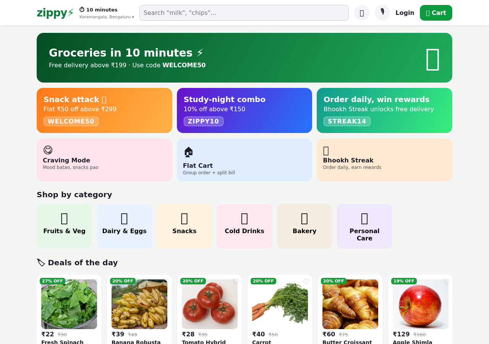
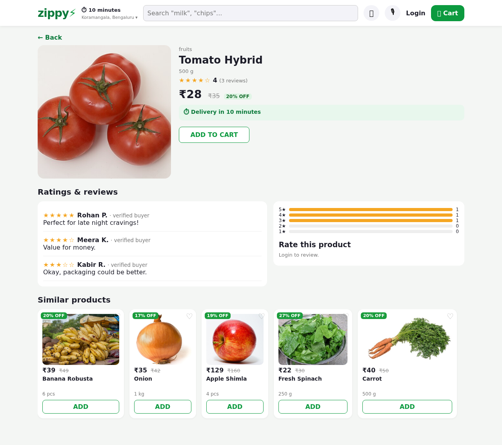
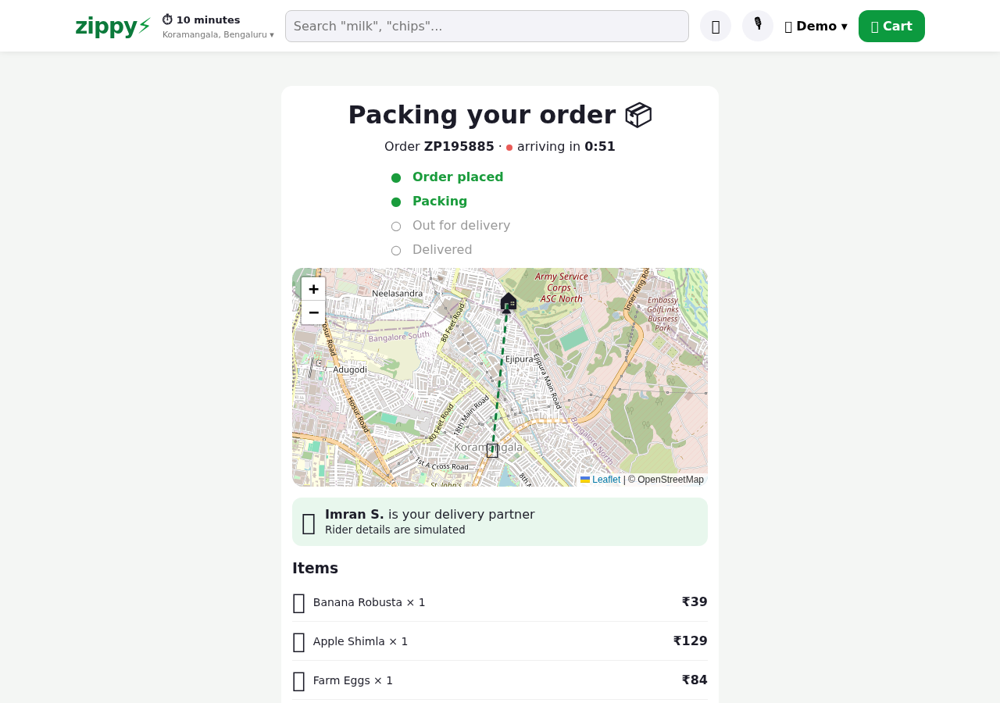
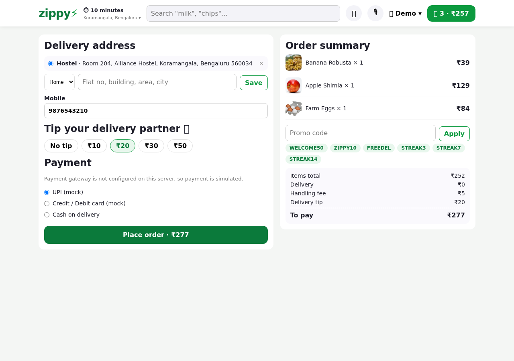
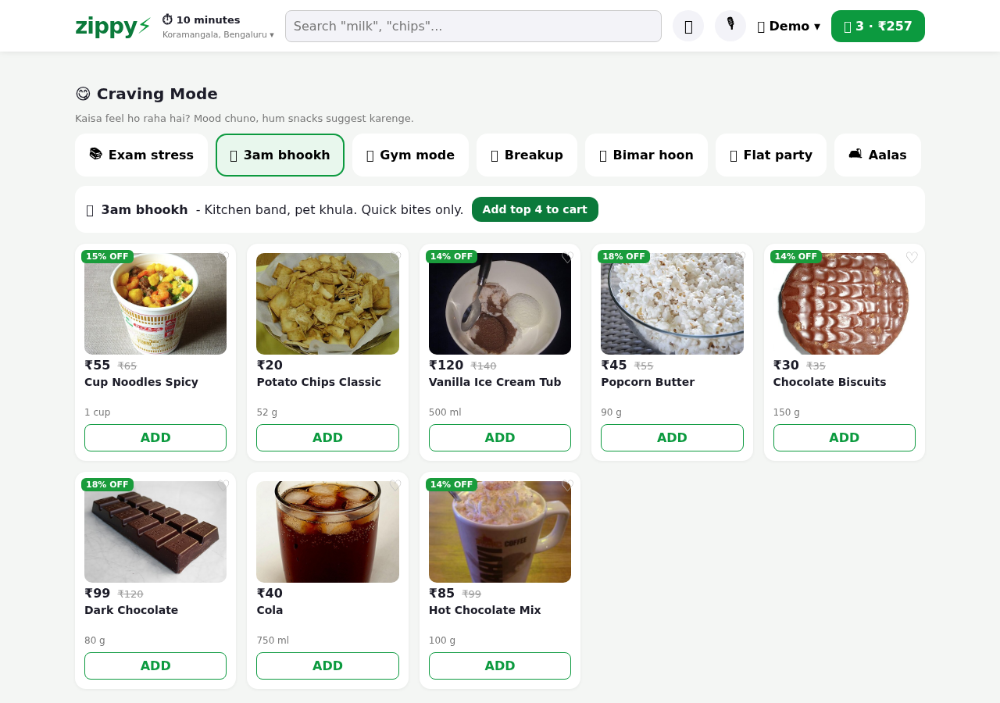
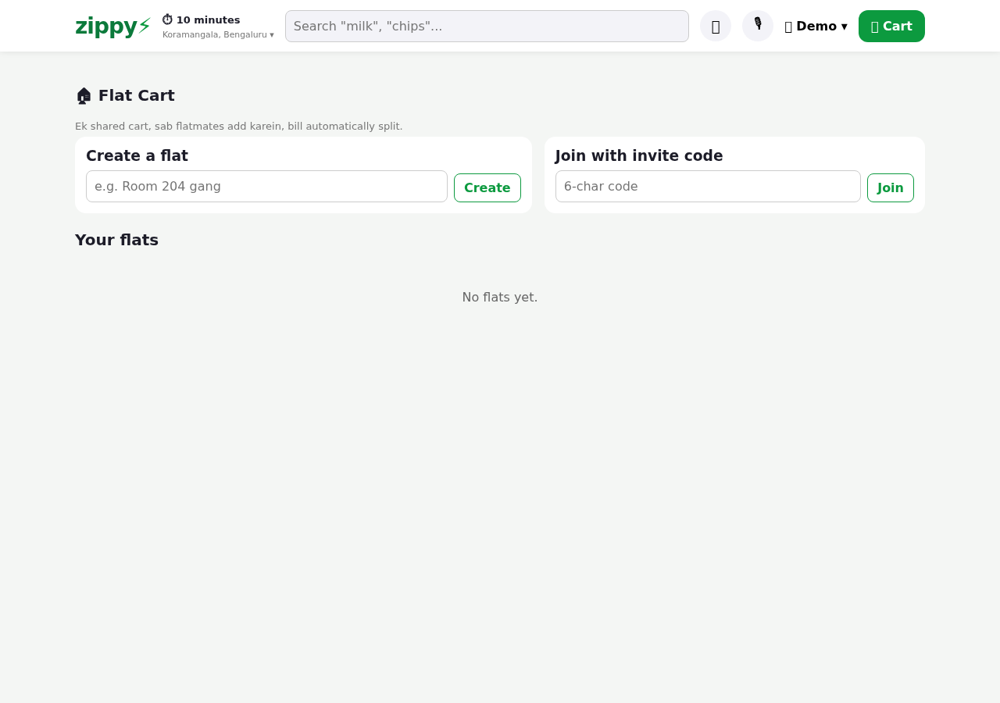
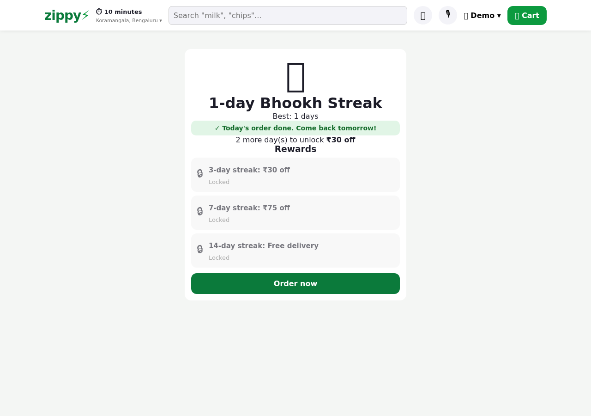

# Zippy ⚡ - 10-minute grocery delivery app

A full-stack quick-commerce web app in the style of Zepto/Blinkit: browse, search, cart, coupons, checkout with Razorpay (test mode), live order tracking on a map, ratings and reviews, and an admin panel. Built from scratch with React, Express and SQLite.

**Live demo:** _add your Render URL here after deploying (see [Deploy](#deploy-to-render))_
**Demo logins:** `demo@zippy.com / demo123` (customer) · `admin@zippy.com / admin123` (admin)



| Product page with reviews | Live order tracking |
|---|---|
|  |  |

| Checkout with tip and coupons | Craving Mode |
|---|---|
|  |  |

| Flat Cart (group order + bill split) | Bhookh Streak |
|---|---|
|  |  |

## Features

**Shopping**
- 37 products in 6 categories with real photos, search with live suggestions, sort (price, discount, rating)
- Product page: photo, discount, stock, ratings breakdown, reviews, similar products
- Deals of the day, Buy again (from your order history), late-night cravings row, offer banners
- Cart drawer with savings, free-delivery threshold, handling fee. Guest cart is merged into your account when you log in
- Wishlist, saved addresses, delivery tip

**Checkout and orders**
- Coupons (`WELCOME50`, `ZIPPY10`, `FREEDEL`) with minimum-order rules
- **Razorpay test-mode payments** (server-side order creation and HMAC signature verification) or simulated payment if no keys are set
- Stock is reserved in a database transaction; unpaid or cancelled orders release it
- **Live order tracking**: server-sent events push every status change, countdown ETA, rider on an OpenStreetMap map (Leaflet), delivery partner card
- Order history, cancel before packing, ratings after delivery (only buyers can review)

**Admin panel** (`/admin`): dashboard (orders, revenue, top products, low stock), add/edit/hide products, manage and advance orders

**Unique features**
- **Flat Cart** - create a flat, share an invite code, flatmates add to one shared cart (you see who added what). Bill split by items or equally; the person who orders pays upfront and the others settle their share. Splits always add up to the total
- **Craving Mode** - pick a mood (exam stress, 3am bhookh, gym, breakup, sick, party, aalas) and get a curated list, add the top picks in one tap
- **Voice Order** - speak or type Hinglish ("2 doodh, ek dozen ande aur teen chips add karo"); a small parser maps quantities and product aliases, you confirm before anything is added (speech uses the browser Web Speech API, Chrome)
- **Bhookh Streak** - order on consecutive days; 3/7/14 day streaks unlock reward coupons (one-time use each)
- Monthly budget tracker with spend by category (flat orders count your share)
- Green and purple themes (🎨 button in the header)

## Tech stack
| Layer | Tech |
|---|---|
| Frontend | React 18, React Router, Vite, Leaflet (OpenStreetMap), plain CSS |
| Backend | Node.js, Express 5, Server-Sent Events |
| Database | SQLite (better-sqlite3), transactions for orders and stock |
| Auth | JWT + bcrypt |
| Payments | Razorpay Orders API + Checkout (test mode) |
| Tests | End-to-end API tests (`npm test`) including a fake Razorpay server and a live-tracking stream test |

## Run it locally
Needs Node.js 18+.

```bash
git clone <your-repo-url> && cd zippy
npm install
npm run dev
```
- App: http://localhost:5173 (Vite proxies `/api` to the API)
- API: http://localhost:3001

The database (`server/zippy.db`) is created and seeded on first start. Delete it to reset.
Production mode (single server): `npm run build && npm start` then open http://localhost:3001.
Run tests: `npm test`.

### Turn on Razorpay test payments
1. Create a free Razorpay account and switch the dashboard to **Test Mode**.
2. Settings > API Keys > Generate Test Key.
3. Copy `.env.example` values into your environment (or set them in Render): `RAZORPAY_KEY_ID`, `RAZORPAY_KEY_SECRET`.
4. Restart. Checkout now shows "Pay online". In test mode use Razorpay's [test card/UPI details](https://razorpay.com/docs/payments/payments/test-card-details/); no real money moves.

The secret key stays on the server. The browser only gets the public key id.

## Deploy to Render
1. Push this repo to GitHub.
2. Render dashboard > **New > Blueprint** > select the repo. `render.yaml` sets everything up (build, start, a generated `JWT_SECRET`).
3. (Optional) In the service's Environment tab add `RAZORPAY_KEY_ID` and `RAZORPAY_KEY_SECRET`.
4. Open the `.onrender.com` URL and paste it at the top of this README.

Free plan notes: the service sleeps after ~15 min idle (first load takes ~30 s) and its disk is ephemeral, so the database resets on every restart and demo data is re-seeded. For persistent data use a paid plan with a disk (see comments in `render.yaml`).

## What is real and what is mocked
| Real | Mocked |
|---|---|
| Accounts, JWT auth, password hashing | Delivery fleet: riders and the route are simulated. An order moves through stages on a timer (`STEP_SECONDS`) and the rider moves in a straight line on the map |
| Product catalog, cart, orders, stock, coupons, reviews in a real database | Delivery address to map location: addresses are mapped to a stable fake point near the store |
| Razorpay Orders API + signature verification (test mode) | Refunds: cancelling a paid order marks it refunded in the DB, no Razorpay refund call |
| Live updates over Server-Sent Events | Real inventory / dark stores: stock is a number per product |
| OpenStreetMap tiles | Sample reviews (seeded demo users), product catalog data |
Without Razorpay keys, UPI/card payments are simulated and marked paid instantly. COD is paid on delivery.

## Project structure
```
server/
  index.js            Express app, serves the built frontend in production
  db.js               schema + seed data
  config.js           env config
  pricing.js          bill and coupon logic (single source of truth)
  orderService.js     order creation (transaction), status changes, bill splitting
  simulator.js        delivery stage simulator + unpaid order sweeper
  events.js           pub/sub behind the live tracking stream
  streak.js, voice.js streak calculation, Hinglish command parser
  routes/             auth, catalog, cart, orders, payments, reviews, flats, wishlist, budget, extras, admin
  test.js             end-to-end API tests
src/
  pages/              Home, ProductDetail, Checkout, OrderDetail, Orders, Flats, FlatDetail, Craving, Streak, Budget, Wishlist, Admin, Auth
  components/         Navbar, ProductCard, CartDrawer, VoiceOrder, TrackMap, AddressPicker, CouponBox, ...
  *Context.jsx        auth, cart, config/theme, toast, wishlist
public/products/      product photos (see docs/IMAGE_CREDITS.md)
```

## Roadmap ideas
Razorpay webhooks and real refunds, real geocoding (Places API) for addresses, WebSocket-based flat cart, PostgreSQL for hosting with persistent data, push notifications, rider app.

## Credits
Product photos: Wikimedia Commons, see [docs/IMAGE_CREDITS.md](docs/IMAGE_CREDITS.md). Map data: © OpenStreetMap contributors. Zippy is an independent student project and is not affiliated with Zepto or any brand shown in photos.

## License
MIT
